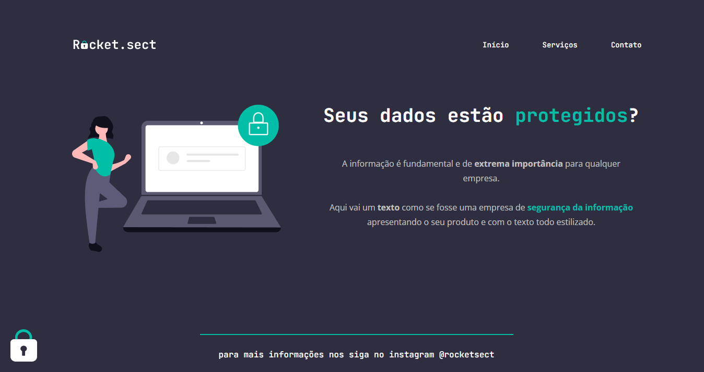

# Recriando Layout Stage 2 🚀

[🔗 Clique aqui para acessar](https://victorm-mp.github.io/Recriando-Layout-Stage2/)

## Tecnologias 🛠
- HTML
- CSS
- Git e Github

## Descrição 📖
Projeto final do Stage 2. Consolidando o aprendizado transformando do 0 um design do figma em uma página web. 

## Contato ⭐
victormatheus.mpm@gmail.com

www.linkedin.com/in/victormatheus-mp
